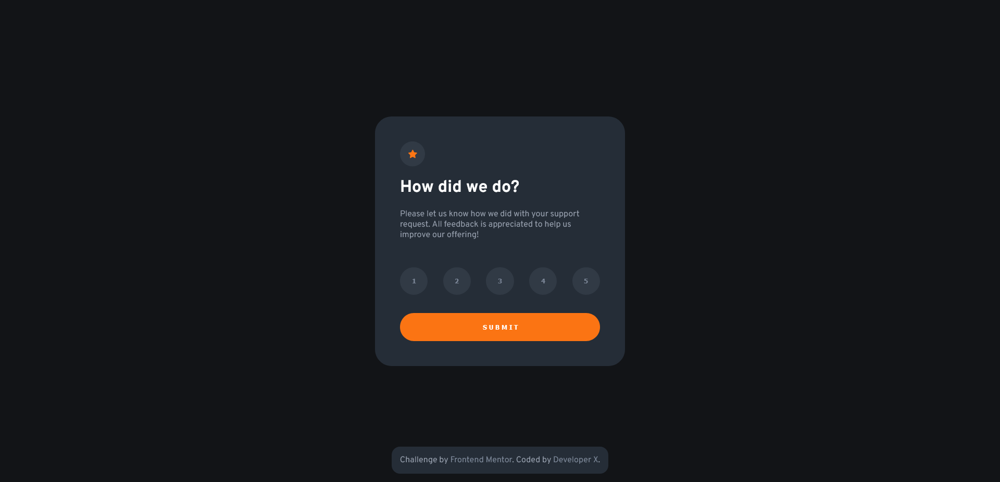

# Frontend Mentor - Interactive rating component solution

This is a solution to the [Interactive rating component challenge on Frontend Mentor](https://www.frontendmentor.io/challenges/interactive-rating-component-koxpeBUmI). Frontend Mentor challenges help you improve your coding skills by building realistic projects. 

## Table of contents

- [Frontend Mentor - Interactive rating component solution](#frontend-mentor---interactive-rating-component-solution)
  - [Table of contents](#table-of-contents)
  - [Overview](#overview)
    - [The challenge](#the-challenge)
    - [Links](#links)
  - [My process](#my-process)
    - [Built with](#built-with)
  - [Author](#author)

## Overview

### The challenge

Users should be able to:

- View the optimal layout for the app depending on their device's screen size
- See hover states for all interactive elements on the page
- Select and submit a number rating
- See the "Thank you" card state after submitting a rating
- If didn't submitted rating, an error pop up will appear

### Links

- Solution URL: [Click Here!](https://www.frontendmentor.io/solutions/interactive-rating-component-CbBCNSB9tM)
- Live Site URL: [Click Here!](https://interactive-rating-component-main-snowy.vercel.app/)

## My process

### Built with

- Semantic HTML5 markup
- CSS custom properties
- Flexbox
- CSS Grid
- Mobile-first workflow

## Author

- Website - [Developer X](https://developer-x-0001.github.io/Portfolio/)
- Frontend Mentor - [@Developer-X-0001](https://www.frontendmentor.io/profile/Developer-X-0001)
- Discord - Developer X#7105
